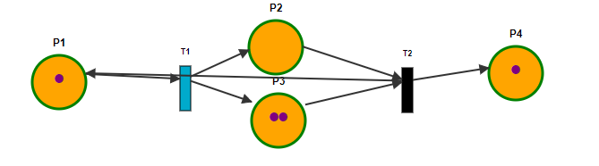
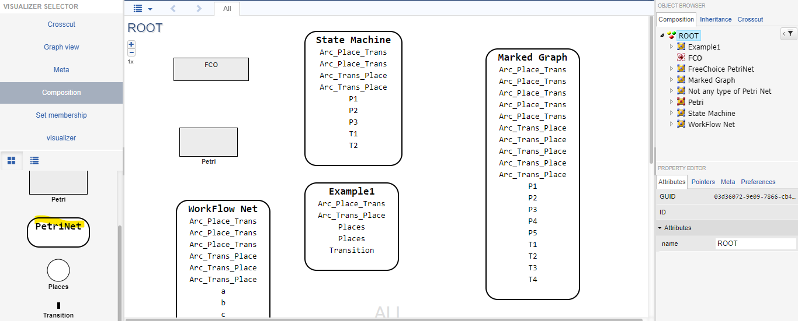
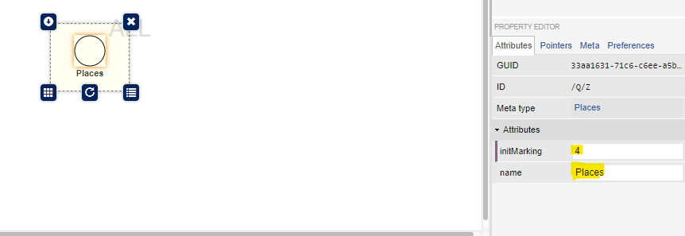
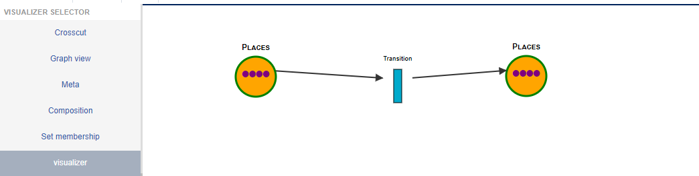
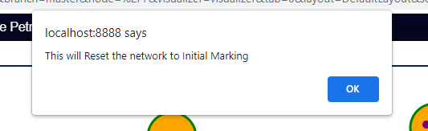
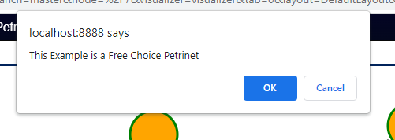
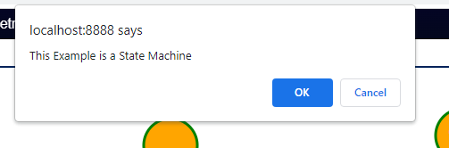
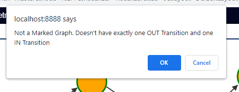
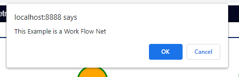

# WebGME - Petri Net Design Studio

* Petrinet is an descriptive tool used to represent Distributed Systems. It is also known as the Place/Transition Net. The Petrinet comprises of Places, Transitions and Arcs(connects the P->T or T->P)

* **Places** hold markings/tokens (⬤) inside them 

* **Transition** fire these tokens from place to place via the Arcs. Transitions are enabled when the corresponding places have tokens/markings in them.
* There are two types of Transitions: **Inplaces(source->place, dest->transition)** , **Outplaces(source->transition,dest->place)**.
* When an enabled transition is fired it decreases the amount of markings on all inplaces with one and
increases the amount of token in all outplaces of the transition by one.

# PetriNet Example

* The below is a Simple Petri Net Example
  

# PetriNet Use Cases
* The Petri Net is run by successively firing all enabled transitions, , the execution of Petri nets is nondeterministic: when multiple transitions are enabled at the same time, they will fire in any order. 
* Petri nets are used for modeling the concurrent behavior of distributed systems.

# Prerequisties

* Mongodb <https://www.mongodb.com/download-center/community/releases/archive> - VERSION 4.4.16(most compatible)
* Nodejs/npm <https://nodejs.org/en/download/> - V14 or V16
* Install webgme-cli : npm install -g webgme-cli
* Docker Desktop <https://docs.docker.com/engine/install/>

# Seed Creation

* After cloning the repository, we need to start the server using Docker.
* Edit the '.env' file so that the BASE_DIR variable points to the main repository directory
* Using docker-compose up -d we need connect to your server at http://localhost:8888
* We can create the Petrinet seed either in our local host or mic.isis.vanderbilt.edu
* We need to create a new project and start configuring the seed
* In the project, after configuring the seed and exporting the webgmex file. We need to add it to our git repository.

# Installation
* After installing the required softwares, we need to download the **petrinet.webgmex** file and place it in the Parent Directory. 
* We need to clone this repository and update the path in the .env folder
* Now we need to run the **create_seed.sh** and give the input as 'petrinet'
* This would automatically create a webgmex file inside the seeds folder in the src.
* Post doing that we need to similarly run the **create_visualizer.sh** an give the necessary inputs, this would also automatically add files in the visualiser folder.
* Same process needs to be followed for **create_plugin.sh**, this would create a file in the plugins folder.
* Now the Design Studio is ready to be executed.

# Modelling
* Post installation, start the server on Docker and create a new project with the petrinet seed. In the root node, drag and drop a PetriNet from the left tools panel into the center. This creates a new Petri net. From here, we can see Places,Transition, Arc in the tools panel. 

* We can create example models using these elements in the Petrinet **Composition** module. Additionally, we can also change the value of the initMarking. This represents the number of markings inside the place. We can edit the name of the place, transition as well.
* 

* We can model 4 different types of Petrinets: **FreeChoice Petrinet, State Machine, Marked Graph, WorkFlow Net.**

* After modelling, we can have a better view of the model in the visualizer module on the left-hand side. 
  

* From here, we can progress to firing the transitions.

# Features
* One of the primary features of this design studio is its **Simulation.** 

* Enabled Transitions are displayed in blue, which are not enabled are black. In the event of a deadlock all transitions are displyed in red. Clicking on any enabled transition will fire it. The tokens which are in transit during the firing are not part of the network until they arrive, so enabled/disabled/deadlock colorings may be different before/during/after the firing. The system is only truly deadlocked if the colorings remain red after all animations are completed.
  
   [Click on the link to view the video](images/simulation.webm)

* Another one of its features is the **Reset Markings**, note that the initMarking attributes of places are applied when we model them in Composition, and we can reset to the initial state at any time by clicking the Reset Markings (reset arrow) button.

* We can locate the Reset Markings button on the toolbar as below.

* Finally, the **Interpreter** in the Design Studio also lets you know what type of a Petri Net classification our model is. It also specifies what is missing in the example model for it to be considered as a particular type of petrinet. 

* There is a Classify Plugin(the open-eye glyphicon) on the toolbar where we can check all 4 classifications of the Petrinet. It would display 4 different popup confirm message stating the IS / IS NOT classification.

* For example : This Example is a FreeChoice Petri Net , This is Example is not a State Machine etc.,
  

# References

* [WDeStuP](https://github.com/kecso/WDeStuP)
* [StateMachineJoint](https://github.com/kecso/StateMachineJoint)
* [PeNDeS](https://github.com/umesh-timalsina/PeNDeS)
* [WebGME-petrinet-visualizer](https://github.com/dragazo/WebGME-petrinet-visualizer)